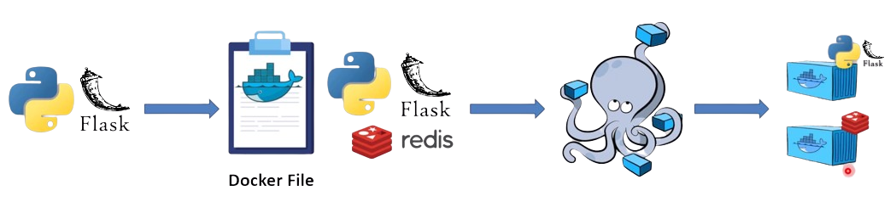
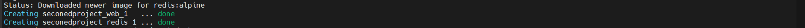

# Flask Application with Docker & Docker Compose

This project demonstrates how to containerize a simple Python **Flask** application along with a **Redis** service using **Docker** and **Docker Compose**.  
The setup shows the complete workflow of building images, running containers, and orchestrating multi-container applications.

---
## Project Architecture



## Project Overview

The architecture consists of:

- A **Flask web application** written in Python.
- A **Redis** in-memory data store.
- A **Dockerfile** to build the Flask app image.
- A **Docker Compose** configuration to orchestrate both services.

  The steps are visually represented in the system architecture diagram available in this          repository.
---

## Project Structure
```bash
project/
├── app.py
├── requirements.txt
├── Dockerfile
└── docker-compose.yml
```
## Step-by-Step Workflow

### 1. Create [app.py](./app.py)
```bash
vim app.py
```
### 2. Create a [requirements.txt](./requirements.txt)
```bash
vim requirements.txt
```
### 3. Create [Dockerfile](./Dockerfile)
```bash
vim Dockerfile
```
### 4. Create [docker-compose.yml](./docker-compose.yml)
```bash
vim docker-compose.yml
```
### 5. Start the Application with Docker Compose
```bash
docker-compose up -d
```



### 6. Verify Running Containers
```bash
docker ps
```

### 7. Access it in your browser:
```bash
http://localhost:9000
```


